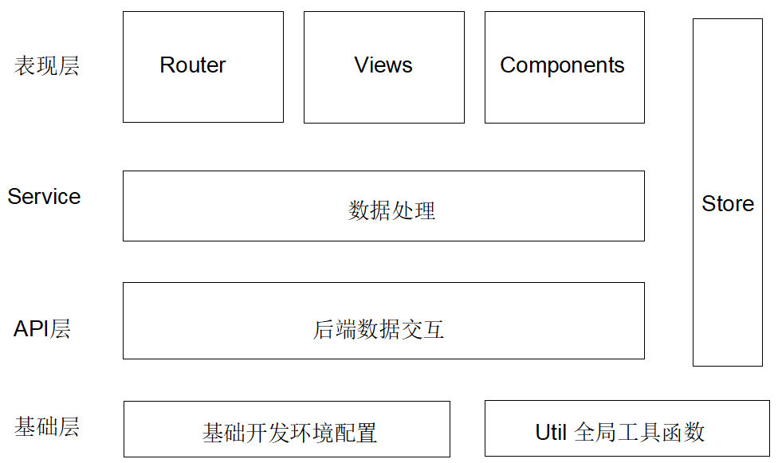

# ape-plan

> 一个包含 eslint + sass + elementui + axios 的基础开发模板。

## Build Setup

``` bash
# 安装开发依赖
npm install #or yarn install

# 本地开发预览 localhost:8089
npm run dev #or yarn run dev

# 压缩打包
npm run build #or yarn run build

# 项目打包文件分析 analyze
npm run analyze #or yarn run analyze

# eslint 代码检查
npm run lint #or yarn run lint

```

## 项目基础结构

### 项目技术栈

整个项目使用了 vue 全家桶：

* normalize.css   // 让默认的 HTML 元素样式保持跨浏览器的高度一致性；
* nprogress  // 浏览器顶部状态指示进度条；
* axios  // http 请求库；
* vue-cli  // 使用 webpack 模板项目初始化工程；
* vuex  // 管理应用级的共享数据
* vue-router   // 页面路由管理
* element-ui  // vue 组件库

### 项目结构

这是一个前后端分离项目的前端部分, 参考阴明关于掘金重构的[幻灯片](http://slides.com/kalasoo/vueconf-juejin-refactor#/) 进行更改, 整个项目分为四个层级：



#### 整体流程:

api 接口获取数据 ---> service 数据处理 ---> store action 状态提交 ---> component getter 获取数据渲染成 views

component 得到用户输入 ---> dispatch stroe 的 action ---> service 数据处理 --> api 请求接口提交

### 目录结构

```bash
|-- build                        // 项目构建相关代码
|   |-- build.js                 // 生产环境构建代码
|   |-- check-version.js         // 检查 Node、Npm 等版本
|   |-- utils.js                 // 构建工具相关
|   |-- vue-loader.conf.js       // Vue-loader 相关配置
|   |-- webpack.base.conf.js     // Webpack 基础配置
|   |-- webpack.dev.conf.js      // Webpack 开发环境配置
|   |-- webpack.prod.conf.js     // Webpack 生产环境配置
|-- config
|   |-- dev.env.js                // 开发环境变量
|   |-- index.js                  // 项目基础配置(例如打包路径,开发代理设置)
|   |-- prod.env.js               // 生产环境变量
|-- dist			  // 打包文件
|-- docs			  // 文档说明
|-- node_modules
|-- src                          // 项目核心源码
|   |-- api                      // 后端交互文件
|   |-- assets                   // 项目静态资源
|   |-- components               // 全局公共组件
|   |-- router                   // 路由文件
|   |-- service                  // 处理请求返回的数据
|   |-- store                    // 全局状态管理(例如用户登陆状态等)
|   |-- utils                    // 全局工具函数
|   |-- views                    // 业务页面
|   |-- App.vue                  // Vue 根组件
|   |-- main.js                  // 入口文件(引入依赖模块)
|-- static                       // 静态文件(例如没有模块化的第三方库)
|-- .babelrc                     // ES6 编译配置
|-- .editorconfig                // 统一代码风格(例如Charset, 空格)
|-- .eslintignore                // ESLint 检查排除的文件
|-- .eslistrc.js                 // ESLint 规则文件
|-- .gitignore                   // Git 上传排除的文件
|-- .postcssrc.js                // Css 文件处理(例如浏览器前缀自动引入)
|-- index.html                   // HTML 基础模板文件
|-- package-lock.json            // 记录当前项目所安装 Package 的具体来源和版本号
|-- package.json                 // 项目配置信息(项目所需模块，项目名称、版本等)
|-- README.md                    // 项目基本说明
```
