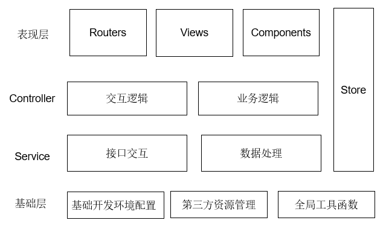

## 项目技术栈

整个项目使用了 Vue 全家桶配合 element-ui 组件库，后期可根据项目的具体需求进行相关类库的引入，项目的基础技术栈如下：

```json
{
  "axios": "^0.18.0", // http 请求库
  "core-js": "^3.0.0", // ES6+ babel polyfill
  "echarts": "^4.2.1", // ECharts 图表
  "element-ui": "^2.7.0", // UI 组件库
  "js-cookie": "^2.2.0", // Cookies 操作库
  "lodash": "^4.17.11",  // 函数工具库
  "normalize.css": "^8.0.1", // 保持 HTML 元素样式跨浏览器的一致性
  "nprogress": "^0.2.0", // 浏览器顶部状态指示进度条
  "vue": "^2.6.10", // 响应式框架
  "vue-i18n": "^8.10.0", // 语言国际化
  "vue-router": "^3.0.2", // Vue 路由
  "vuex": "^3.1.0" // Vue store 状态管理
}
```

## 项目分层

整个项目分为四个层级：

1. 基础层：项目的一些与业务无关的基础开发环境配置，包括热更新、压缩打包、代码检查、模块化处理、按需加载、代码编译降级等；
2. 服务层：与后端的数据交互部分，包括对后端接口的统一管理、数据格式化处理等；
3. 逻辑层：分为交互逻辑和业务逻辑两部分，其中交互逻辑负责对 ViewModel 的数据操作管理，业务逻辑负责相关的业务代码实现；
4. 表现层：分为路由、视图、组件三个部分，其中路由控制页面的跳转，视图是页面的主要展示区域，一个完整的页面视图由多个组件构成。



## 数据流

* 全局状态
  * api(数据接口) --> service(数据处理) --> store(状态管理) --> component(逻辑处理) --> views(页面渲染)
  * input(用户输入) --> component(逻辑处理) --> service(数据处理) --> store(状态管理) --> api(数据接口)

* 组件状态
  * api(数据接口) --> service(数据处理) --> component(逻辑处理) --> views(页面渲染)
  * input(用户输入) --> component(逻辑处理) --> service(数据处理) --> api(数据接口)

## 目录结构

```bash
|-- public
|   |-- index.html               // HTML 基础模板文件
|   |-- favicon.ico              // 网站图标
|   |-- static                   // 无需打包的静态文件(例如没有模块化的第三方库)
|-- dist                         // 打包文件(最终部署到服务器的文件)
|-- docs                         // 项目文档
|-- node_modules                 // 开发依赖包
|-- src                          // 项目核心源码
|   |-- apis                     // 后端交互接口
|   |-- assets                   // 项目静态资源
|   |   |-- iconfont             // 字体图标
|   |   |-- scss                 // 全局样式
|   |-- components               // 全局公共组件
|   |-- filters                  // 过滤器
|   |-- lang                     // 语言文件
|   |-- layouts                  // 页面整体布局
|   |-- libs                     // 第三方组件库的封装
|   |-- mixins                   // 全局混入
|   |-- router                   // 路由文件
|   |-- service                  // 格式化前后端交互的数据
|   |-- store                    // 全局状态管理(例如用户登陆信息等)
|   |-- utils                    // 全局工具函数
|   |-- views                    // 业务页面
|   |-- App.vue                  // Vue 根组件
|   |-- main.js                  // 全局入口文件
|-- .browserslistrc              // 浏览器兼容性设置
|-- .editorconfig                // 统一代码风格(例如 Charset, 空格)
|-- .eslintignore                // ESLint 检查排除的文件
|-- .eslintrc.js                 // ESLint 配置规则文件
|-- .npmrc                       // ESLint 排除项
|-- .babelrc                     // npm 配置
|-- postcss.config.js            // CSS 文件处理(例如浏览器前缀自动引入)
|-- package.json                 // 项目配置信息(项目所需模块，项目名称、版本等)
|-- vue.config.js                // Vue 项目基础配置项(例如 webpack 打包，开发热更新等)
|-- README.md                    // 项目基本说明
```
